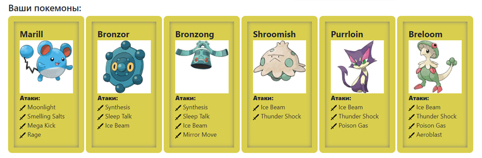
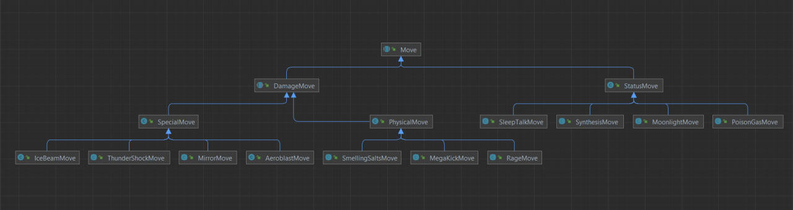
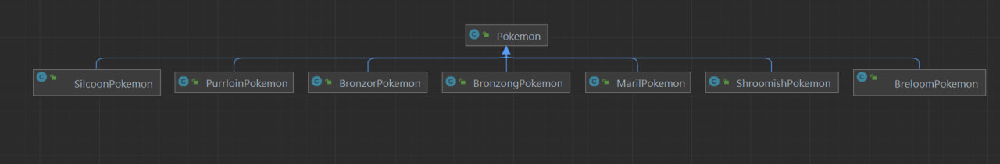

<p align="center" style ="font-size: 24px"><em>Факультет программной инженерии и компьютерной техники</em></p>

<p align="center" style ="font-size: 24px"><strong>Лабораторная работа №2 </br>
По дисциплине : «Программирование»</br>
Вариант 11117</strong>
</p>
<p align="left">Преподаватель: <strong>Чупанов Аликылыч Алибекович</strong></br>
Выполнила: <strong>Логинова Ольга Олеговна</strong></br>
Группа: <strong>P3131</strong>
</p>

# Лабораторная работа #2

## 1. Текст задания.

<div class="journal-content-article">
<p>На основе базового класса <code>Pokemon</code> написать свои классы для заданных видов покемонов. Каждый вид покемона должен иметь один или два типа и стандартные базовые характеристики:</p>

<ul>
	<li>очки здоровья (HP)</li>
	<li>атака (attack)</li>
	<li>защита (defense)</li>
	<li>специальная атака (special attack)</li>
	<li>специальная защита (special defense)</li>
	<li>скорость (speed)</li>
</ul>

<p>Классы покемонов должны наследоваться в соответствии с цепочкой эволюции покемонов. На основе базовых классов <code>PhysicalMove</code>, <code>SpecialMove</code> и <code>StatusMove</code> реализовать свои классы для заданных видов атак.</p>

<p>Атака должна иметь стандартные тип, силу (power) и точность (accuracy). Должны быть реализованы стандартные эффекты атаки. Назначить каждому виду покемонов атаки в соответствии с вариантом. Уровень покемона выбирается минимально необходимым для всех реализованных атак.</p>

<p>Используя класс симуляции боя <code>Battle</code>, создать 2 команды покемонов (каждый покемон должен иметь имя) и запустить бой.</p>

<p>Базовые классы и симулятор сражения находятся в <a href="/documents/10180/660917/Pokemon.jar/a7ce60af-6ee6-47d0-a95e-e5ed9a697bd2">jar-архиве</a>&nbsp;(обновлен 9.10.2018, исправлен баг с добавлением атак и кодировкой). Документация в формате javadoc - <a href="https://se.ifmo.ru/~tony/doc/">здесь</a>.</p>

<p>Информацию о покемонах, цепочках эволюции и атаках можно найти на сайтах <a class="moz-txt-link-freetext" href="http://poke-universe.ru">http://poke-universe.ru</a>, <a class="moz-txt-link-freetext" href="http://pokemondb.net">http://pokemondb.net</a>,<a class="moz-txt-link-freetext" href="http://veekun.com/dex/pokemon"> http://veekun.com/dex/pokemon</a></p>
						</div>

<div class="journal-content-article">
							<h4>Комментарии</h4>

<p>Цель работы: на простом примере разобраться с основными концепциями ООП и научиться использовать их в программах.</p>

<p>Что надо сделать (краткое описание)</p>

<ol>
	<li>Ознакомиться с <a href="https://se.ifmo.ru/~tony/doc/">документацией</a>, обращая особое внимание на классы <code>Pokemon </code>и <code>Move</code>. При дальнейшем выполнении лабораторной работы читать документацию еще несколько раз.</li>
	<li>Скачать файл Pokemon.jar. Его необходимо будет использовать как для компиляции, так и для запуска программы. Распаковывать его не надо! Нужно научиться подключать внешние jar-файлы к своей программе.</li>
	<li>Написать минимально работающую программу и посмотреть как она работает.
	<pre>Battle b = new Battle();
Pokemon p1 = new Pokemon("Чужой", 1);
Pokemon p2 = new Pokemon("Хищник", 1);
b.addAlly(p1);
b.addFoe(p2);
b.go();
</pre>
	</li>
	<li>Создать один из классов покемонов для своего варианта. Класс должен наследоваться от базового класса <code>Pokemon</code>. В конструкторе нужно будет задать типы покемона и его базовые характеристики. После этого попробуйте добавить покемона в сражение.</li>
	<li>Создать один из классов атак для своего варианта (лучше всего начать с физической или специальной атаки). Класс должен наследоваться от класса <code>PhysicalMove </code>или <code>SpecialMove</code>. В конструкторе нужно будет задать тип атаки, ее силу и точность. После этого добавить атаку покемону и проверить ее действие в сражении. Не забудьте переопределить метод <code>describe</code>, чтобы выводилось нужное сообщение.</li>
	<li>Если действие атаки отличается от стандартного, например, покемон не промахивается, либо атакующий покемон также получает повреждение, то в классе атаки нужно дополнительно переопределить соответствующие методы (см. документацию). При реализации атак, которые меняют статус покемона (наследники <code>StatusMove</code>), скорее всего придется разобраться с классом <code>Effect</code>. Он позволяет на один&nbsp;или несколько ходов изменить состояние покемона или модификатор его базовых характеристик.</li>
	<li>Доделать все необходимые атаки и всех покемонов, распределить покемонов по командам, запустить сражение.</li>
</ol>
						</div>
            <h4>Покемоны:</h4>



## 2.Диаграмма классов реализованной объектной модели.




## 3. Результат работы программы.

(часть вывода пропущена из-за его размера)

```java
        SilcoonPokemon Silicoon из команды красных вступает в бой!
        BronzorPokemon Bronzor из команды белых вступает в бой!
        BronzorPokemon Bronzor промахивается

        SilcoonPokemon Silicoon использует атаку Ice Beam.
        BronzorPokemon Bronzor теряет 2здоровья.

        BronzorPokemon Bronzor борется с соперником.
        SilcoonPokemon Silicoon теряет 187здоровья.
        BronzorPokemon Bronzor теряет 47здоровья.
        SilcoonPokemon Silicoon теряет сознание.
        Pokemon Хищник из команды красных вступает в бой!
        BronzorPokemon Bronzor промахивается

        Pokemon Хищник борется с соперником.
        BronzorPokemon Bronzor теряет 4здоровья.
        Pokemon Хищник теряет 1здоровья.

        BronzorPokemon Bronzor промахивается

        Pokemon Хищник борется с соперником.
        BronzorPokemon Bronzor теряет 4здоровья.
        Pokemon Хищник теряет 1здоровья
        BronzongPokemon Bronzong промахивается
        BronzorPokemon Bronzor промахивается
        BronzongPokemon Bronzong промахивается
        BronzorPokemon Bronzor борется с соперником.
        BronzongPokemon Bronzong теряет 178здоровья.
        BronzorPokemon Bronzor теряет 45здоровья.
        Оба покемона теряют сознание.
        В команде красных не осталось покемонов.
        Команда белых побеждает в этом бою!
```

## 4. Выводы по работе.

Я познакомилась с ООП Java.Познакомилась с такими понятиями, как наследование, полиморфизм и инкапсуляция.
Научилась создавать и инициализировать объекты, вызывать методы,
создавать классы, наследовать их. Узнала про модификаторы доступа,
области видимости переменных,
а также про модификаторы final и static.


