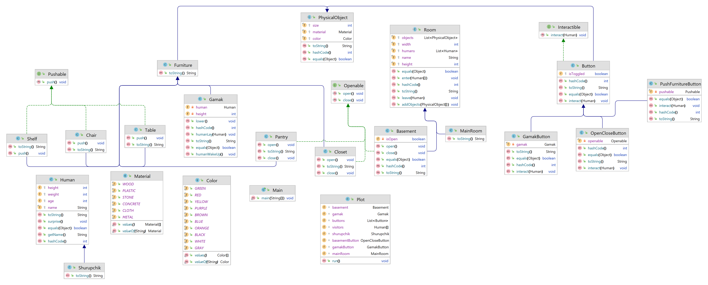

# Лабораторная работа №3

**Описание предметной области, по которой должна быть построена объектная модель:**

> Шурупчик нажал еще одну кнопку, и, к изумлению зрителей, гамак начал медленно опускаться. Он опускался до тех пор,
> пока лежавший в нем Шурупчик не растянулся на полу. Шурупчик принялся ходить по комнате и нажимать разные кнопки, в
> результате чего откидывались новые столы, стулья и полки, открывались дверцы различных шкафов и кладовушек. Наконец он
> нажал еще одну кнопку и провалился в подполье.

**Программа должна удовлетворять следующим требованиям:**

1. Доработанная модель должна соответствовать принципам SOLID.
2. Программа должна содержать как минимум два интерфейса и один абстрактный класс (номенклатура должна быть согласована
   с преподавателем).
3. В разработанных классах должны быть переопределены методы equals(), toString() и hashCode().
4. Программа должна содержать как минимум один перечисляемый тип (enum).

**Порядок выполнения работы:**

1. Доработать объектную модель приложения.
2. Перерисовать диаграмму классов в соответствии с внесёнными в модель изменениями.
3. Согласовать с преподавателем изменения, внесённые в модель.
4. Модифицировать программу в соответствии с внесёнными в модель изменениями

## 2.Диаграмма классов реализованной объектной модели.

