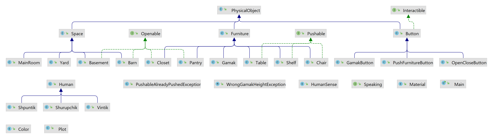

# Лабораторная работа №4

**Описание предметной области, по которой должна быть построена объектная модель:**

> Шурупчик нажал еще одну кнопку, и, к изумлению зрителей, гамак начал медленно опускаться. Он опускался до тех пор,
> пока лежавший в нем Шурупчик не растянулся на полу.
> Шурупчик принялся ходить по комнате и нажимать разные кнопки, в результате чего откидывались новые столы, стулья и
> полки, открывались дверцы различных шкафов и кладовушек. Наконец он нажал еще одну кнопку и провалился в подполье.
>
> -Идите сюда! - послышался через минуту со двора его голос.
>
> Друзья вышли во двор.
>
> -Здесь у меня гараж, - сказал Шурупчик, подводя Винтика и Шпунтика к каменному сараю с широкой железной дверью.
>
**Программа должна удовлетворять следующим требованиям:**

1. В программе должны быть реализованы 2 собственных класса исключений (checked и unchecked), а также обработка
   исключений этих классов.
2. В программу необходимо добавить использование локальных, анонимных и вложенных классов (static и non-static).

**Порядок выполнения работы:**

1. Доработать объектную модель приложения.
2. Перерисовать диаграмму классов в соответствии с внесёнными в модель изменениями.
3. Согласовать с преподавателем изменения, внесённые в модель.
4. Модифицировать программу в соответствии с внесёнными в модель изменениями.

## Что добавилось в 4 лабораторной по сравнению с 3?

1. Добавлен package **exception** с классами **PushableAlreadyPushedException** и **WrongGamakHeightException**.

* класс **PushableAlreadyPushedException** создан для обработки исключений типа **checked**. Гениальная концепция
  такова:
  нельзя откинуть предмет, который уже был откинут, потому что заедает кнопка.У меня такие предметы - это столы, стулья,
  полки (их наш шизоидный Шурупчик push в соответствии с текстом "Шурупчик принялся ходить по комнате и нажимать разные
  кнопки, в результате чего откидывались новые столы, стулья и полки...").
  Соответственно в классах **Chair**, **Table** и **Shelf** в методе **push()** выбрасывается исключение. Обработка
  этого исключения происходит в классе
  **PushFurnitureButton**.

* класс **WrongGamakHeightException** создан для обработки исключений типа **unchecked**. Еще более гениальная концепция
  такова: наш гамак,
  который опускается до пола при нажатии кнопки класса **GamakButton**, очевидно можно опуститься до высоты равной 0.
  Но если вдруг кто-то решит опустить гамак на отрицательную высоту (соболезную),
  то бубубу прога, конечно, скомпилириуется,
  но получим вот такое исключение при выполнении:
  
  Исключение выбрасывается в классе **Gamak** в методе **lower()**.

## Reminder: как была реализована лабораторная 3.

Для начала стоит сказать, что в коде иногда проскальзывают мои авторские замечания, возможно не слишком
умные и корректные.

Были созданы базовые абстрактные классы для базовых сущностей:

1. Класс **PhysicalObject** - предназначен для любых физических вещей в повествовании, имеет размер, материал и цвет.
   Материал и цвет являются перечислимыми типами (**Enum**).
2. Класс **Human** - предназначен для персонажей в повестовании, имеет возраст, высоту, вес и имя.
3. Класс **Room** - предназначен для какого-либо помещения, содержит в себе список объектов и персонажей, а также
   размеры самого помещения.

Были созданы классы конкретных объектов, которые наследуются от этих абстрактных классов, например:

1. **Basement** для помещения подвала, который наследуется от **Room**
2. **Chair** для стула, который наследуется от **Furniture** (родительский класс для любой мебели), который наследуется
   от **PhysicalObject**.

Также, чтобы объединить общее поведение некоторых классов были созданы интерфейсы:

1. Интерфейс **Pushable** - содержит метод **push()**, используется в тех классах мебели, которую можно пнуть (раскидать
   по комнате).
2. Интерфейс **Openable** - содержит методы **open()** и **close()**, используется в классах объектов, которые можно
   открыть или закрыть. Например, шкаф или подвал.
3. Интерфейс **Interactible** - содержит метод **interact()**, используется в классах объектов, с которыми могут
   взаимодействовать персонажи. В нашем случае - это только кнопки **Button**.

Чтобы объединить всё это есть класс **Plot**. В его конструкторе мы создаем обстановку (окружение), а в методе **run()**
происходит сюжетное действие и вызываются соответствующие методы различных объектов.
При этом одни объекты могут воздействовать на другие, например, вызов **OpenCloseButton.interact()** ("Шурупчик нажимал
разные кнопки") может привести к вызову **Closet.open()** ("открывались дверцы различных шкафов")

## Диаграмма классов реализованной объектной модели.

